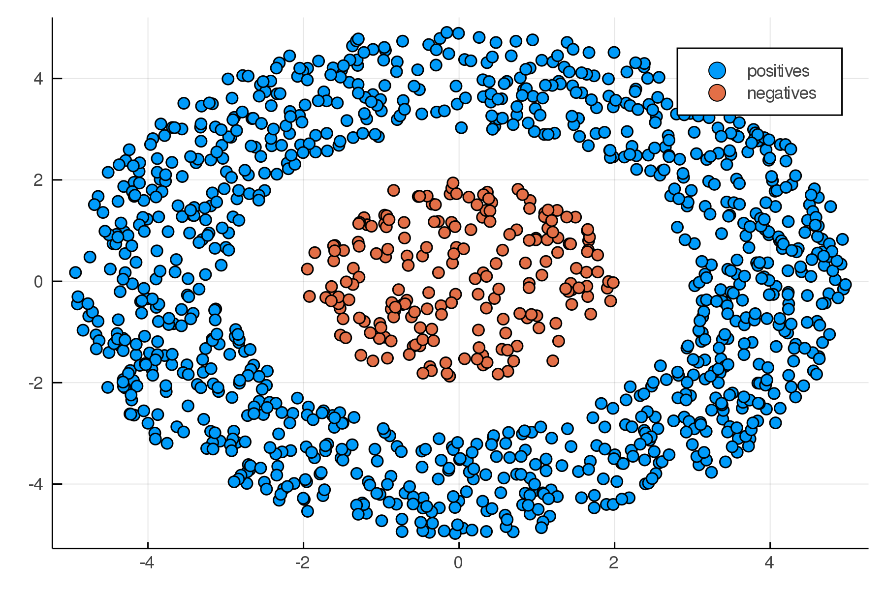
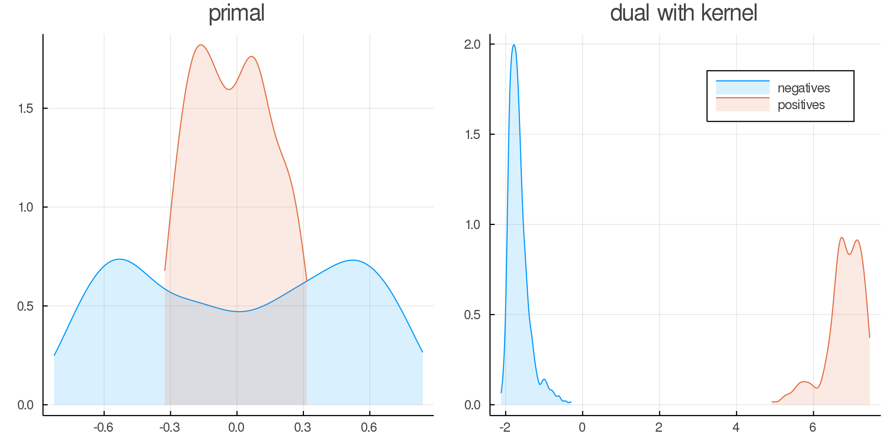

##  ClassificationOnTop.jl
This repository is a complementary material to our paper ["General Framework for Nonlinear Binary Classification on Top Samples"]().

# Installation

This package can be installed using pkg REPL as follows
```julia
] pkg> add https://github.com/VaclavMacha/ClassificationOnTop_new.jl
```

# Usage

This package provides following methods:
* Methods:
    1. `TopPush(C, surrogate)`
    2. `TopPushK(K, C, surrogate)`
    3. `PatMat(τ C, surrogate, surrogate)`
    4. `PatMatNP(τ C, surrogate, surrogate)`
* Surrogates:
    1. `Hinge(ϑ)`
    2. `Quadratic(ϑ)`
* Problems:
    1. primal
    2. dual
* Solvers:
    1. `General` ([ECOS](https://github.com/JuliaOpt/ECOS.jl) solver)
    2. `Gradient` (our)
    3. `Coordinate` (our)

## Simple example

The following example is provided to demonstrate how to use the package. Firstly, we generate some random data

```julia
using ClassificationOnTop, StatsPlots, Random

Random.seed!(1234)

function random_circle(n::Int; radius::Tuple = (0,1), origin::Tuple = (0,0))
    rmin, rmax = round.(Int, radius.^2)
    r2 = (rmax - rmin) .* rand(n) .+ rmin
    θ  = 2π .* rand(n)

    x = origin[1] .+ sqrt.(r2) .* cos.(θ)
    y = origin[2] .+ sqrt.(r2) .* sin.(θ)
    return x, y
end

nneg, npos = 1000, 200
xneg, yneg = random_circle(nneg; radius = (3, 5));
xpos, ypos = random_circle(npos; radius = (0, 2));

X = [xneg yneg; xpos ypos];
y = 1:(nneg+npos) .> nneg;
nothing #hide
```

In this case, we use linearly inseparable data, as shown in the figure below

```julia
plt1 = scatter(X[y .== 0, 1], X[y .== 0, 2], label = "positives")
scatter!(X[y .== 1, 1], X[y .== 1, 2], label = "negatives", dpi = 300)
savefig(plt1, "data.png")
```



Then we have to define model, problems and solvers. In this case, we use `TopPushK` model, `Primal` and `Dual` problem and `Gradient` (for the primal problem) and `Coordinate` (for the dual problem) solver.

```julia
model  = TopPushK(10, 1, Quadratic(1))

data_p = Primal(X, y);
data_d = Dual(model, X, y; kernel = GaussianKernel());

solver_p = Gradient(maxiter = 1000, optimizer = Descent(0.0001))
solver_d = Coordinate(maxiter = 1000)
```

Finally, we can call `solve` function to solve our model

```julia
solution_p = solve(solver_p, model, data_p);
solution_d = solve(solver_d, model, data_d);
```

For simple visual verification, we use density estimates of classification scores.

```julia
scores_p = scores(model, data_p, solution_p.w);
scores_d = scores(model, data_d, solution_d.α, solution_d.β);

plt_p = density(scores_p[y .== 0]; trim = true, fill = (0, 0.15), title = "primal", legend = false)
density!(scores_p[y .== 1]; trim = true, fill = (0, 0.15))
plt_d = density(scores_d[y .== 0]; label = "negatives", trim = true, fill = (0, 0.15), title = "dual with kernel")
density!(scores_d[y .== 1]; label = "positives", trim = true, fill = (0, 0.15))
plt = plot(plt_p, plt_d, layout = (1,2), size = (800, 400), dpi = 300)
savefig(plt, "scores.png")
```



